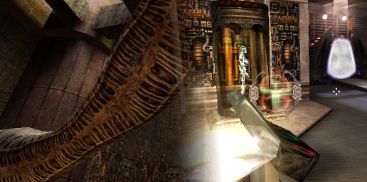

# Materials

**Materials**, also formerly known **Q3 shaders** or wrongly referred to as just **shaders** are scripts that define texture and surface properties.

## History

In the id Tech series of engines, **id Tech 3/Quake III Arena** was the first to introduce such a system, wrongly referred to back then as **shaders**. This was before vertex and fragment shaders were commonplace in the video-game asset pipeline.



They effectively merged the Quake texture-prefix hacks and Quake II .wal surface flags into one plain text format.

Starting with **id Tech 4/Doom III** in 2004, the name of **shader** was changed to **material** to avoid confusion with proper GPU oriented vertex and fragment shaders.

**FTEQW** has since coupled the old 'shader' syntax with proper GPU shaders using the [program](Documentation/Materials/commands/program.md) material command.

## What is a Material?

Materials are short text scripts that define the properties of a surface as it both appears and functions in the game world.

If you want your sky texture to be replaced with a **skybox**, you will have to write a material definition for that.

If you want to have a surface that looks and acts like water, then you have to write a material for that too. Unlike earlier **id Tech** games no assumption over a surface should be made based on texture names alone.

### When using older BSP formats...

Then you can still use modern materials! While the engine may load a texture from a **.bsp** or **.wad** file directly, it will still (albeit internally) create a material for it.

When ingame, look at your surface you want to replace with the console variable **r_showshaders** set to **1* - and you will see the path and the contents of the material you're looking at. You can use that information to override rendering for practically any surface, even when using old fileformats.

## Usage

When the engine looks for a texture, it will look for a material file in the file-tree first, then it will attempt to 'make one up' if only an image file is present. A rendereable surface will **always** have a material. The question is whether you provide it, or if the engine has to automatically generate one internally.

The file extension for materials in Nuclide is .mat. There are two ways of defining materials:

- A large .shader script file containing multiple materials inside the **./scripts/** folder (not recommended)
- One small .mat file with the same path as the texture. E.g: **models/weapons/handcannon/w_handcannon/w_handcannon.mat** handles **models/weapons/handcannon/w_handcannon/w_handcannon.tga** 

A material file consists of a series of surface attributes (global scope) and rendering instructions formatted within braces ("{" and "}"). Below you can see a simple example of syntax and format for a single process, including the VMAP keywords or 'Surface Parameters', which follow the first bracket and a single bracketed 'stage':

```
  // Vera Visions Material
  {
    diffusemap textures/common/lava.tga
    vmap_tessSize 64
    {
      program unlit
      blendFunc add
    }
  }
```

The first line is a simple comment. All the official textures are marked that way.

`diffusemap` defines a texture sampler to associate with the material, it'll also be used by the real-time lights to render an impacted surface, hence why it's defined at a global scope. Other materials may need to be aware of it. The compiler also uses it to compute radiosity.

`vmap_tessSize` will tell the BSP compiler to tesselate the surface in a specific way. This affects the entire surface and not just a single rendering stage, hence why it's defined at a global scope.

We then follow into the territory of defining specific rendering instructions within braces ("{" and "}"), most of the time that's not needed if we're defining a simple, opaque material. However in this case we want to make sure that we have 1 rendering stage that blends additively. Things such as real-time lights and the BSP compiler ignore these additional stages entirely.

`program unlit` will tell it not to be affected by lighting and just use a simple fullbright shader.

`blendFunc add` will now tell the renderer that this surface is no longer opaque and will be blended with whatever equation will result in an additive blend.

[You can read more about those commands in detail right here.](MatCommands.md)

## Engine generated materials

If no material definition for a surface is present, the engine will create an internal one.
It's generally a primitive material using the internal **defaultwall** shader if it's a world texture, the **defaultskin** texture if it's a model, or a **default2d** if it's a HUD element.

## Q3A style materials, without GLSL

You can support old-style Q3A materials alongside modern shader oriented ones.

```
    {
        if $programs
            program vertexlit
            diffusemap "models/weapons/handcannon/w_handcannon.dds"
            normalmap "models/weapons/handcannon/w_handcannon_normal.dds"
        else
            {
                map "models/weapons/handcannon/w_handcannon.tga"
                rgbGen lightingDiffuse
            }
        endif
    }
```

Here everything inside the **if $programs** block will only ever load if it's capable of handling the GLSL.
So if the player has a card that does not support programmable shaders, the **else** path will take over.
