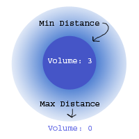

# Sound: soundDef
Nuclide mimics the sound defintion spec from **idTech 4** somewhat, albeit
with some changes/enhancements. We call them **soundDefs**.

**The elevator pitch**: To allow for more control over the sounds than what was previously
allowed in idTech engines we also allow designers to drop sounds into
the game without having to set some common parameters every time.

Instead of directly calling which .wav or .ogg file to play, we tell it
to play the single name of a sound def. For example:
*c1_sentry_loader_in* which can be located in **any** text file ending
with the **.sndshd** file extension inside the `sound/` directory.

```
  c1_sentry_loader_in
  {
    dist_min	10
    dist_max	25
  
    no_occlusion
    volume	0.25
  
    sample sound/movers/comm1/sentry_loader_in.wav
  }
```


-   dist_min / dist_max sets the radius where the sound fades out. The
    sound is at maximum volume inside 'dist_min' radius, and it
    completely silent after 'dist_max' radius.
-   The no_occlusion key tells the engine not to take level geometry in
    to account when calculating volume.
-   'volume' is the volume inside the inner radius of the sound.
-   The last line sets the actual sound file to play.

Let's take a look at another one:

```
  emetal_impacts
  {
    dist_min	5
    dist_max	45
    volume	0.5
  
    sample sound/impact/ambient_impacts/emetal_01.wav
    sample sound/impact/ambient_impacts/emetal_02.wav
    sample sound/impact/ambient_impacts/emetal_03.wav
    sample sound/impact/ambient_impacts/emetal_04.wav
    sample sound/impact/ambient_impacts/emetal_05.wav
  }
```

This one has multiple sound files specified, which means that **Nuclide** will randomly choose one to play.

## Commands {#commands}

|                 |                         |                                                                                                             |
|-----------------|-------------------------|-------------------------------------------------------------------------------------------------------------|
| **Key**         | **Value**               | **Description**                                                                                             |
| attenuation     | idle/static/none/normal | Changes the sound's attenuation, aka playback radius/distance. This essentially just changes **dist_max**.  |
| dist_min        | <float>                 | Sets the minimum playback distance in quake units.                                                          |
| dist_max        | <float>                 | Sets the maximum playback distance in quake units.                                                          |
| volume          | <float>                 | Sets the playback volume. 0.0 - 1.0 range.                                                                  |
| shakes          | <float>                 | Will shake the screen with an intensity specified. Play around with this, 256 is a good starting value.     |
| pitch           | <float>                 | Will set a specific pitch change. 0.0 - 2.0 range most commonly, but there's wiggle room.                   |
| pitch_min       | <float>                 | Will set a minimum pitch instead of an exact one. This means it'll play a random pitch between min and max. |
| pitch_max       | <float>                 | Will set a maximum pitch instead of an exact one. This means it'll play a random pitch between min and max. |
| offset          | <float>                 | Sound sample offset in seconds.                                                                             |
| looping         | none                    | Sound set to force loop, regardless of sound markers in file.                                               |
| nodups          | none                    | Don't play duplicate samples in sequence.                                                                   |
| global          | none                    | Play samples everywhere.                                                                                    |
| private         | none                    | Play samples privately onto the entity that it gets played on.                                              |
| no_reverb       | none                    | Disable any [EAX](/EAX "wikilink") on samples in this def.                                               |
| omnidirectional | none                    | Samples won't play from any particular direction.                                                           |
| follow          | none                    | Samples will move alongside the entity it's being played on                                                 |
| footstep        | none                    | Determines sample volume based upon the speed of the entity.                                                |
| distshader      | <string>                | Which sound def to play to everyone who is out of playback reach of this one.                            |
| sample          | <string>                | Adds a sample to play to the list. Will only play one at a time.                                            |

## Power to the developer {#power_to_the_developer}

Unlike the implementation in **idTech 4**, all of the sound defs handling
is done in the game-logic and is therefore exposed to all developers.
Some mods may want to hook AI callbacks into the system, or create
visual effects when commands are called by a sound def. The
possibilities are endless!